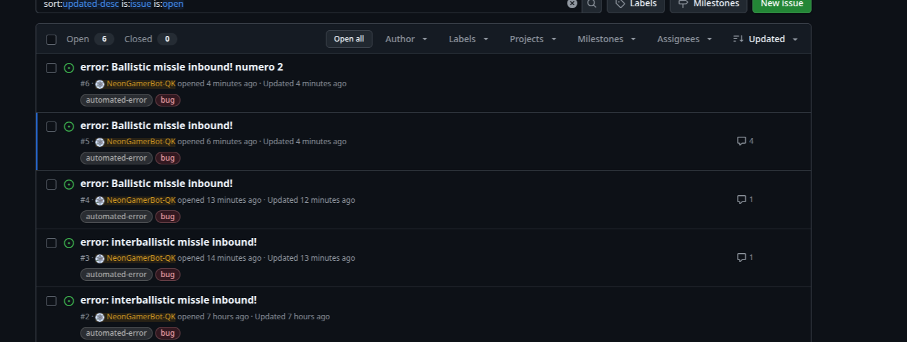

# gh-error


Make github issues about your nodejs errors!

## Installation

```bash
npm install gh-error
# or
pnpm add gh-error
# or
yarn add gh-error
```

## Usage

Pretty shrimple, one could say.

```js
import { ErrorHandler } from "gh-error";

const handler = new ErrorHandler({
  ghPat: process.env.GH_PAT, // GitHub personal access token (required)
  // Optional: auto-detected from git if not provided
  repoOwner: "your-username",
  repoName: "your-repo",
});

// Bind to process errors (uncaughtException, unhandledRejection)
handler.bindToErrors();

// Or handle errors manually
try {
  throw new Error("Something went wrong!");
} catch (e) {
  await handler.handleError(e);
}
```

### Environment Variables

Set your GitHub PAT in your environment:

```bash
GH_PAT=ghp_your_token_here
```

### What It Does

When an error occurs, gh-error will:

1. Create a GitHub issue with the error details and a Mermaid diagram
2. If the same error occurs again, it comments on the existing issue
3. If a closed issue matches the error, it reopens it

Issues are tagged with `automated-error` and `bug` labels.
